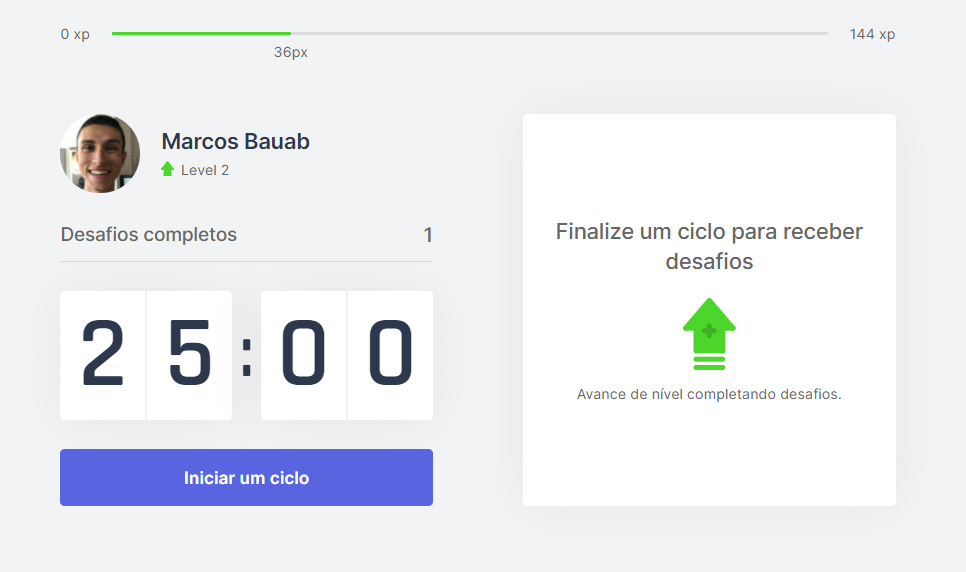

# moveit-next

  <a href="https://movase-teal.vercel.app"></img></a>

> Next Level Week 4.0 da Rocketseat, em Next.js
 


Projeto realizado na semana da NLW da Rocketseat, visando usar o método Pomodoro para dar pausas em períodos de desenvolvimento e preservar a saúde do corpo e olhos.



## Veja o projeto

Versão 1.0 lançada na Vercel, segue o link [mova.se](https://movase-teal.vercel.app).

## Instalação

```sh
# Para clonar o repositório
git clone https://github.com/MarcosBauab/moveit-next

# Entre no diretório
cd moveit-next

# E instale as dependências pelo yarn
yarn
```

## Para rodar
```sh
yarn dev
```

_O app rodará na porta localhost:3000_
